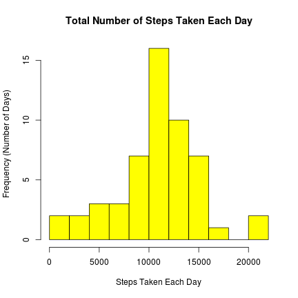
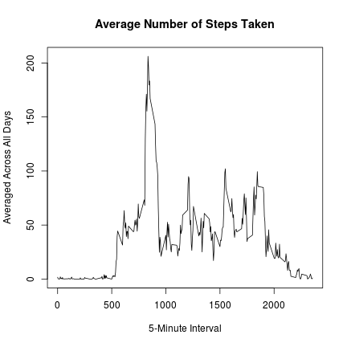
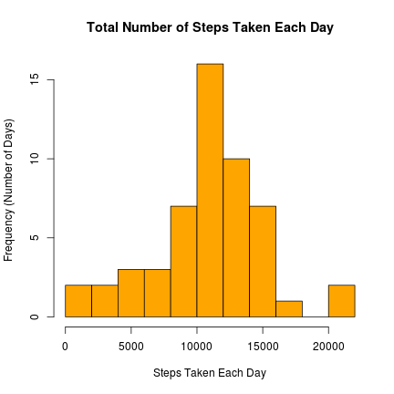
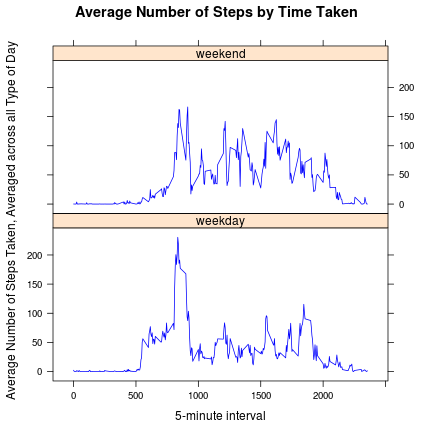

# Reproducible Research: Peer Assessment 1

Setting up 'knitr' options

```r
opts_chunk$set(message = FALSE, fig.width = 6, fig.height = 6)
```

## Loading and preprocessing the data
### 1. Load the data (i.e. read.csv())

```r
if(!file.exists('activity.csv')){unzip('activity.zip')}
activity<- read.csv(("activity.csv"), sep= ",", na.strings= "NA", colClasses= c("numeric","Date","numeric"))
```

View the column names

```r
names(activity)
```

```
## [1] "steps"    "date"     "interval"
```

Display the internal structure of the data frame

```r
str(activity)
```

```
## 'data.frame':	17568 obs. of  3 variables:
##  $ steps   : num  NA NA NA NA NA NA NA NA NA NA ...
##  $ date    : Date, format: "2012-10-01" "2012-10-01" ...
##  $ interval: num  0 5 10 15 20 25 30 35 40 45 ...
```

View the first part of the matrix

```r
head(activity)
```

```
##   steps       date interval
## 1    NA 2012-10-01        0
## 2    NA 2012-10-01        5
## 3    NA 2012-10-01       10
## 4    NA 2012-10-01       15
## 5    NA 2012-10-01       20
## 6    NA 2012-10-01       25
```

### 2. Process/transform the data (if necessary) into a format suitable for your analysis 
Remove the incomplete data

```r
clean_data<- activity[complete.cases(activity),]
```

## What is mean total number of steps taken per day?
For this part of the assignment, you can ignore the missing values in the dataset.
### 1. Calculate the total number of steps taken per day

Using aggregate, sum the steps by day - without the missing values

```r
sum_by_day<- aggregate(steps ~ date, clean_data, sum)
```

### 2. If you do not understand the difference between a histogram and a barplot, research the difference between them. Make a histogram of the total number of steps taken each day

A histogram is a graphical representation of the distribution of numerical data. It is an estimate of the probability distribution of a continuous quantitative variable.

Use hist which is plotted by plot.histogram on the Total Number of Steps Taken Each Day

```r
hist(sum_by_day$steps, 
     col= "yellow", 
     main= "Total Number of Steps Taken Each Day", 
     xlab= "Steps Taken Each Day", ylab = "Frequency (Number of Days)",
     breaks= 10)
```

 

### 3. Calculate and report the mean (average) and median (split) of the total number of steps taken per day 

Mean and median the total number of steps taken per day with the missing values

```r
mean_total<- mean(sum_by_day$steps)
median_total<- median(sum_by_day$steps)
```

*The mean and median are respectively 10766 and 10765 steps taken per day.*

```r
mean_total
```

```
## [1] 10766.19
```

```r
median_total
```

```
## [1] 10765
```

The histogram shows a normal distribution of the total number of steps 
taken per day. By looking at the histogram, the mean and median are approximately 
equal and between 10,000 and 15,000 steps per day.

## What is the average daily activity pattern?
Using aggregate, mean (average) the steps by the interval for each without 
the missing values for each day

```r
average<- aggregate(steps ~ interval, clean_data, mean)
```

Look at the averages before plotting

```r
head(average)
```

```
##   interval     steps
## 1        0 1.7169811
## 2        5 0.3396226
## 3       10 0.1320755
## 4       15 0.1509434
## 5       20 0.0754717
## 6       25 2.0943396
```

### 1. Make a time series plot (i.e. type = "l") of the 5-minute interval (x-axis) and the average number of steps taken, averaged across all days (y-axis)

```r
plot(
  x = average$interval,
  y = average$steps,
  type = "l",
  main = "Average Number of Steps Taken",
  xlab = "5-Minute Interval",
  ylab = "Averaged Across All Days"
)
```

 
### 2. Which 5-minute interval, on average across all the days in the dataset, contains the maximum number of steps?

Using the average across all days dataset, find the which.max steps in the steps vector
of the average data set and then find row in the average dataset by the interval

```r
average[which.max(average$steps),]
```

```
##     interval    steps
## 104      835 206.1698
```
*The highest average was at interval 835 of 206.1698 in row 104.*

## Imputing missing values
Note that there are a number of days/intervals where there are missing values 
(coded as NA). The presence of missing days may introduce bias into some a
calculations or summaries of the data.

### 1. Calculate and report the total number of missing values in the dataset (i.e. the total number of rows with NAs)

```r
sum(is.na(activity))
```

```
## [1] 2304
```

*The total number of missing values in the dataset was 2304.*

### 2. Devise a strategy for filling in all of the missing values in the dataset. The strategy does not need to be sophisticated. For example, you could use the mean/median for that day, or the mean for that 5-minute interval, etc.


```r
clean_activity<- activity
clean_activity <- clean_activity[is.na(clean_activity),]
avg_array <-tapply(activity$steps, activity$interval,mean, na.rm=TRUE)
for (i in which(is.na(clean_activity)))
  clean_activity[i,1] <- avg_array[((i-1)%%288)+1]
imput_activity<-merge(activity, clean_activity, by=c("date","interval"), all.x = TRUE, sort = TRUE)
imput_activity[is.na(imput_activity)] <- 0
imput_activity$steps<- imput_activity$steps.x+ imput_activity$steps.y
```

### 3. Create a new dataset that is equal to the original dataset but with the missing data filled in.

```r
imput_activity<- subset(imput_activity, select =-c(steps.y, steps.x ))
```

## 4. Make a histogram of the total number of steps taken each day and Calculate and report the mean and median total number of steps taken per day. Do these values differ from the estimates from the first part of the assignment? What is the impact of imputing missing data on the estimates of the total daily number of steps?

```r
imput_sum_by_day<- aggregate(steps ~ date, sum_by_day<- aggregate(steps ~ date, clean_data, sum), sum)
```

View the head of imput_sum_by_day the total number of steps taken each day 

```r
head(imput_sum_by_day)
```

```
##         date steps
## 1 2012-10-02   126
## 2 2012-10-03 11352
## 3 2012-10-04 12116
## 4 2012-10-05 13294
## 5 2012-10-06 15420
## 6 2012-10-07 11015
```

Make a histogram for the total numer of steps taken each day

```r
hist(imput_sum_by_day$steps, 
     main = "Total Number of Steps Taken Each Day",
     col = "orange",
     xlab = "Steps Taken Each Day", ylab = "Frequency (Number of Days)", 
     breaks = 10)
```

 

Calculate the mean and median over total number of steps taken per day 

```r
imput_mean_total<- mean(imput_sum_by_day$steps)
imput_median_total<- median(imput_sum_by_day$steps)
```

*After imputing missing values, the mean for the total number of steps per day
is 10766.16 and the median is 10765.*

```r
imput_mean_total
```

```
## [1] 10766.19
```

```r
imput_median_total
```

```
## [1] 10765
```

*If you recall, the corresponding mean and median value computed with the 
dataset of missing values removed was 10766.19 and 10765 respectively. Even
with the 2304 rows of missing data, it not seem to have a impact on the 
estimates of the total average daily number of steps as expected.*

## Are there differences in activity patterns between weekdays and weekends?
For this part the weekdays() function may be of some help here. Use the 
dataset with the filled-in missing values for this part.

### 1.Create a new factor variable in the dataset with two levels – “weekday” and “weekend” indicating whether a given date is a weekday or weekend day.

Use the weekdays function to create the wdays column

```r
day_type <- function(date) {
  if (weekdays(as.Date(date)) %in% c("Saturday", "Sunday")) {
    "weekend"
  } else {
    "weekday"
  }
}
```

Set the wday column as a factor spplying the functon to the column

```r
imput_activity$wday <- as.factor(sapply(imput_activity$date, day_type))
```

# View the head of the imput_activity with the weekday column

```r
head(imput_activity)
```

```
##         date interval     steps    wday
## 1 2012-10-01        0 1.7169811 weekday
## 2 2012-10-01        5 0.3396226 weekday
## 3 2012-10-01       10 0.1320755 weekday
## 4 2012-10-01       15 0.1509434 weekday
## 5 2012-10-01       20 0.0754717 weekday
## 6 2012-10-01       25 2.0943396 weekday
```

### 2. Make a panel plot containing a time series plot (i.e. type = "l") of the 5-minute interval (x-axis) and the average number of steps taken, averaged across all weekday days or weekend days (y-axis). See the README file in the GitHub repository to see an example of what this plot should look like using simulated data.

Get the list of wdays from the imput_acitivty data with NAs

```r
wdays<- list(interval = imput_activity$interval, day = imput_activity$wday)
```

Aggreate over the steps and find the mean by wday for each 5-minute interval

```r
imput_activity_wday <- aggregate(imput_activity$steps, wdays, mean)
names(imput_activity_wday) <- c("interval", "wday", "steps")
```

Import lattice for the xyplot style plot shown in the README

```r
if (!require("lattice")) {install.packages("lattice")}
require(lattice)
```

Make a panel plot containing a time series plot of the 5-minute interval 
and the average number of steps taken, averaged across all weekday days 
and weekend days

```r
xyplot(steps ~ as.numeric(interval) | as.factor(wday), 
       data = imput_activity_wday, 
       type = "l", 
       layout = c(1, 2), 
       col = c("blue"), 
       main = "Average Number of Steps by Time Taken", 
       xlab = "5-minute interval", 
       ylab = "Average Number of Steps Taken, Averaged across all Type of Day")
```

 
